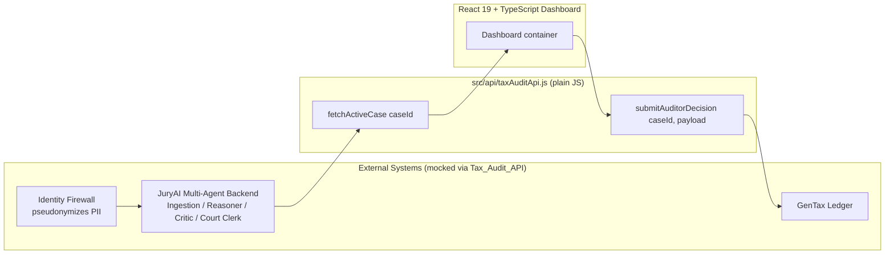
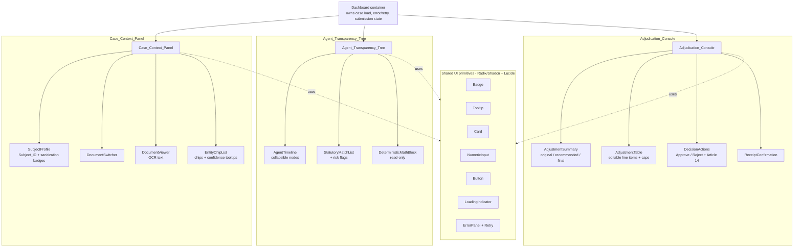
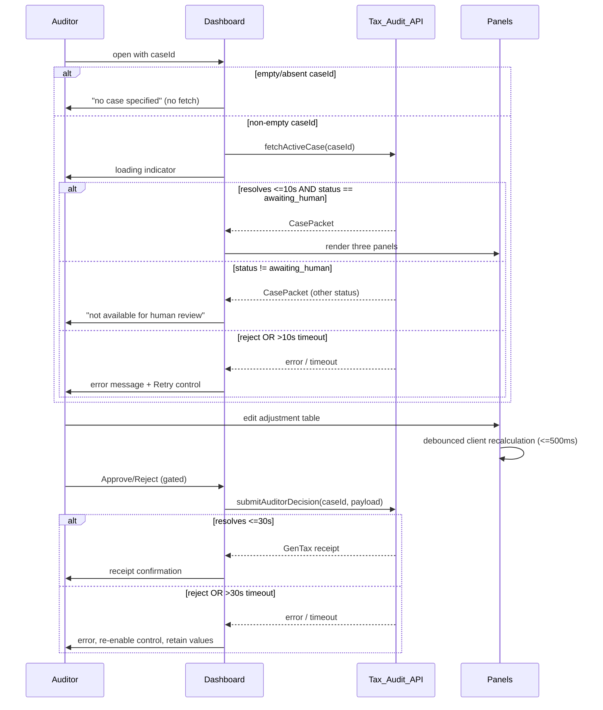
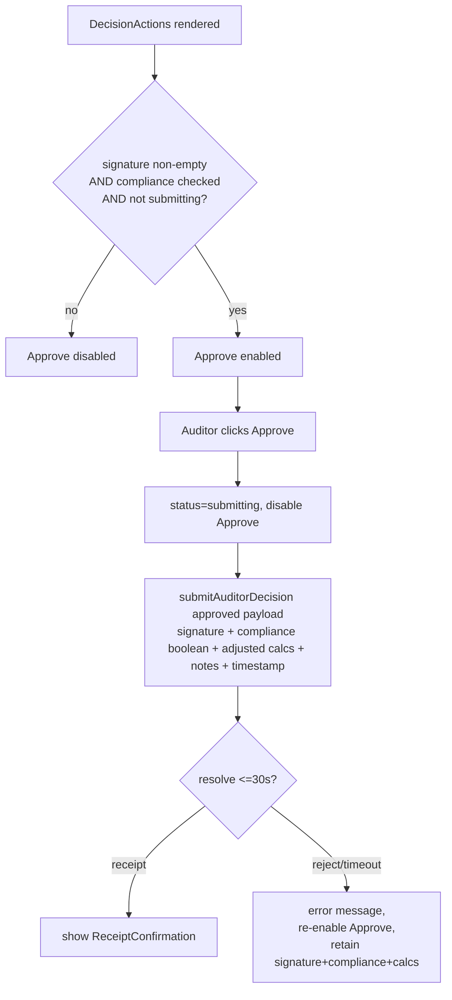
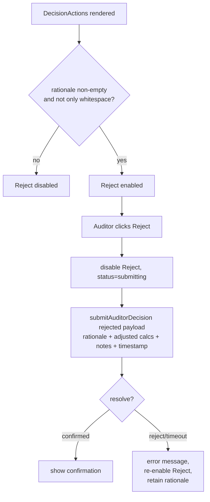

# Design Document

## Overview

The Tax Audit Review Dashboard is a React 19 + TypeScript single-page application, built with Vite, that provides the mandatory Human-in-the-Loop (HITL) oversight checkpoint required under EU AI Act Article 14 for AI-assisted tax adjudication at the Finnish Tax Administration (Verohallinto). The dashboard loads a single case in `awaiting_human` status, presents the multi-agent reasoning that produced a recommendation, lets an auditor inspect deterministic calculations and override deduction line items, and records a certified binding decision into the GenTax core ledger.

The application is intentionally decoupled from any specific runtime. All external systems — the JuryAI agent backend, the Identity Firewall, and the GenTax ledger — are represented through a single standalone mocked API module (`src/api/taxAuditApi.js`) written in plain JavaScript using Promise and fetch semantics (Requirement 14). This keeps the presentation layer portable and independently testable, and lets the mocked contract be swapped for a real backend without touching component code.

The UI is a three-panel horizontal layout composed under a top-level `Dashboard` container:

- **Case_Context_Panel** (left) — pseudonymous citizen profile, PII sanitization badges, document switcher, OCR text, and entity chips (Requirements 2, 3, 4).
- **Agent_Transparency_Tree** (center) — the multi-agent debate timeline, statutory matches, Critic risk flags, and the isolated Deterministic Math Block (Requirements 5, 6, 7, 8).
- **Adjudication_Console** (right) — adjustment summary cards, the editable adjustment table with real-time recalculation, and the Approve/Reject HITL controls with Article 14 certification (Requirements 9, 10, 11, 12, 13).

The theme is a high-density enterprise dark-mode built on Tailwind CSS with Radix UI / Shadcn primitives and Lucide-React icons, using shared styling tokens across all panels and maintaining a body-text contrast ratio of at least 4.5:1 (Requirements 2, 7, 8, 15).

### Design Goals and Rationale

| Goal | Rationale | Requirements |
|------|-----------|--------------|
| Strict separation of deterministic vs probabilistic content | Auditors must trust computed figures as non-generated. Deterministic values are shown read-only and never re-derived on the client. | 8, 9 |
| Client recalculation is transparent and bounded | The auditor's overrides drive a client-side net-tax recalculation, but the authoritative backend math (income, cap, brackets) is never recomputed. | 8, 9, 10 |
| Fail-safe gating of binding actions | Approve requires signature + Article 14 certification; Reject requires a non-empty rationale. Gating is enforced in UI state, not just visually. | 11, 12, 13 |
| Portable, testable API contract | A plain-JS mocked layer with explicit validation and rejection paths keeps components decoupled and enables property-based testing of the contract. | 14 |
| Deterministic, resilient state handling | Every async path (load, submit) has explicit loading, timeout, error, and retry states with value retention. | 1, 11, 12 |

## Architecture

### System Context

The dashboard is the front-end boundary of a larger event-driven system. It only ever interacts with the mocked `Tax_Audit_API`; all other systems sit behind that contract.



### Component Hierarchy



The `Dashboard` container is the single owner of case-level async state (load status, timeout, error, retry, and submission lifecycle). Each panel is a presentational-plus-local-state module. Cross-panel data (the `CasePacket`) flows down as props; the only state that flows back up to the container is the submission trigger and its payload. This satisfies the modular-file constraint of Requirement 15.1, where `Case_Context_Panel`, `Agent_Transparency_Tree`, `Adjudication_Console`, and the `Tax_Audit_API` each live in their own source file.

### Module Layout

```
src/
  api/
    taxAuditApi.js            # Requirement 14 - plain JS, no runtime coupling
    mockData.js               # fixture CasePackets keyed by caseId (mock only)
  types/
    casePacket.ts             # CasePacket + nested TS interfaces
    decision.ts               # AuditorDecision + GenTaxReceipt types
  lib/
    recalculation.ts          # pure net-tax recalculation + validation
    validation.ts             # field-level validation helpers
    agentOrder.ts             # canonical agent ordering
    format.ts                 # percent/currency formatting
    theme.ts                  # shared Tailwind token map
  components/
    Dashboard.tsx
    CaseContextPanel.tsx
    AgentTransparencyTree.tsx
    AdjudicationConsole.tsx
    ui/                       # Badge, Tooltip, Card, NumericInput, etc.
  App.tsx
  main.tsx
```

Recalculation and validation logic is deliberately extracted into pure modules (`src/lib`) with no React dependency. This is the code that carries universal correctness properties and is the primary target of property-based testing.

### Data Flow: Load → Review → Decide



## Components and Interfaces

### Dashboard (container)

Responsibilities:
- Read the `caseId` (from route/query/prop). If empty or absent, render the "no case specified" state and issue no fetch (Requirement 1.6).
- Invoke `fetchActiveCase(caseId)` and manage a `LoadState` state machine (Requirement 1.1, 1.2).
- Enforce the 10-second load timeout via `Promise.race` against a timer, mapping timeout to the error state with a Retry control (Requirement 1.5).
- Branch on the returned `CasePacket.status`: render panels only for `awaiting_human`; otherwise render the "not available for human review" message (Requirement 1.3, 1.4).
- Own the submission lifecycle (`idle | submitting | success | error`) shared by Approve and Reject, including the 30-second submit timeout and value retention on failure (Requirements 11, 12).

`LoadState` machine:

```
idle -> (caseId empty) -> no_case
idle -> (caseId present) -> loading
loading -> (resolve, status awaiting_human) -> ready
loading -> (resolve, other status) -> unavailable
loading -> (reject | >10s) -> error
error -> (retry) -> loading
```

### Case_Context_Panel (left)

- **SubjectProfile** renders `Subject_ID` exactly as received, or an "unavailable" placeholder when missing/empty (Requirement 2.1, 2.5). Renders two sanitization badges (Name Masked, SSN Tokenized) with three visual states — active, inactive, unknown — distinguishable by both color and text label, never color alone (Requirement 2.2, 2.3, 2.4, 2.6).
- **DocumentSwitcher** lists every document in CasePacket order, labeled by its provided document label, with the selected document visually distinguished; selects the first document by default; shows a "no documents" message when empty (Requirement 3.1, 3.2, 3.3, 3.4).
- **DocumentViewer** shows the selected document's OCR text, or a "no parsed text" message while keeping the document selected (Requirement 3.5).
- **EntityChipList** renders one chip per extracted entity with its label; a hover tooltip (<=200 ms) shows label + confidence; confidence displays as a whole-percent value 0–100 with a trailing `%`, or an "unavailable" indication when absent; shows a "no entities" message when empty (Requirement 4.1–4.5).

### Agent_Transparency_Tree (center)

- **AgentTimeline** renders one node per agent present, in canonical order (Ingestion → Reasoner → Critic → Court Clerk), omitting absent agents while preserving relative order; all nodes start collapsed; expanding/collapsing a node toggles only that node; expanded nodes show system prompt, context contract, and reasoning output, with distinguishable placeholders for missing fields; shows a "no agent timeline" message when there are no entries (Requirement 5.1–5.6).
- **StatutoryMatchList** renders a card per `Statutory_Match` showing the cited Tuloverolaki paragraph and the deduction claim, placeholders for missing fields, and a "no statutory matches" message when empty (Requirement 6.1–6.5). Each card renders the Critic risk indicators associated with its claim.
- **Risk flags**: verified indicator plus three warning badges (high-risk, missing-receipt, counterfactual-geography), each visually distinct from the others; all present classifications on a claim are shown; a claim with no flag shows no indicator or badge (Requirement 7.1–7.7).
- **DeterministicMathBlock** displays total income, allowable deduction cap, and tax-bracket adjustments exactly as provided, inside a labeled, bordered container visually separated from the timeline, all read-only with no editable control, and placeholders for absent values (Requirement 8.1–8.4).

### Adjudication_Console (right)

- **AdjustmentSummary** shows three cards: Original Claim and AI Recommended Adjustment, both rendered exactly as provided with no client re-derivation; and Final Auditor Balance, initialized to the AI Recommended Adjustment and updated within 1 second of any adjustment-table change; placeholders when source values are absent (Requirement 9.1–9.5).
- **AdjustmentTable** provides an editable numeric input per deduction line item and per cap percentage; on a valid change it recalculates net tax owed on the client within 500 ms; invalid inputs (non-numeric, empty, negative line item, cap outside 0–100 inclusive) produce a validation message and either retain the last valid value or exclude the invalid value from recalculation (Requirement 10.1–10.6).
- **DecisionActions** holds the auditor signature input, the Article 14 Compliance_Confirmation checkbox, the Approve control (disabled unless signature present and checkbox checked and no submission in flight), the Reject control with its mandatory rationale field (disabled while the rationale is empty/whitespace), and submits via `submitAuditorDecision` (Requirements 11, 12, 13).
- **ReceiptConfirmation** displays the returned GenTax transaction receipt on success (Requirement 11.5, 12.5).

## Data Models

All TypeScript interfaces below live under `src/types`. Fields that may be absent in the CasePacket are modeled as optional (`?`) so that the "placeholder for missing value" requirements are expressible in the type system. Numeric monetary values are represented as `number` with an accompanying `unit` string where the requirements call for a value-and-unit pairing (Requirement 8.3).

### CasePacket

```typescript
export type CaseStatus =
  | "awaiting_human"
  | "processing"
  | "closed"
  | "escalated"
  | string; // tolerate unknown backend statuses; only awaiting_human is reviewable

export interface CasePacket {
  caseId: string;
  status: CaseStatus;
  subject: SubjectMetadata;
  documents: ParsedDocument[];
  agentDebate: AgentLogEntry[];
  statutoryMatches: StatutoryMatch[];
  deterministicMath: DeterministicMathBlock;
  adjustmentSummary: AdjustmentSummary;
  adjustmentLineItems: AdjustmentLineItem[];
  capPercentages: CapPercentage[];
}
```

### Pseudonymous Subject Metadata

```typescript
export type SanitizationStatus = "active" | "inactive"; // absent field => unknown

export interface SubjectMetadata {
  subjectId?: string;             // e.g. "SUBJECT-4921"; absent/empty => placeholder (Req 2.5)
  nameMasked?: SanitizationStatus;    // absent => unknown badge state (Req 2.6)
  ssnTokenized?: SanitizationStatus;  // absent => unknown badge state (Req 2.6)
}
```

The badge state resolves to `active | inactive | unknown` (Requirement 2.2–2.4, 2.6). `unknown` corresponds to the field being absent from the packet.

### Parsed Document Blocks

```typescript
export interface ParsedDocument {
  label: string;          // document label shown in the switcher (Req 3.1)
  ocrText?: string;       // absent/empty => "no parsed text" message (Req 3.5)
  entities: EntityChip[]; // empty => "no entities" message (Req 4.4)
}

export interface EntityChip {
  label: string;             // shown on the chip (Req 4.1)
  confidence?: number;       // 0..1 or 0..100 normalized to whole percent (Req 4.3);
                             // absent => "unavailable" indication (Req 4.5)
}
```

Confidence is normalized and rendered as a whole percent in the range 0–100 with a trailing `%` by `format.ts` (Requirement 4.3). The formatter clamps to `[0, 100]` and rounds to the nearest whole percent.

### Agent Debate Log

```typescript
export type AgentName =
  | "Ingestion_Agent"
  | "Reasoner_Agent"
  | "Critic_Agent"
  | "Court_Clerk";

export interface AgentLogEntry {
  agent: AgentName;
  systemPrompt?: string;     // missing => placeholder in expanded node (Req 5.5)
  contextContract?: string;  // missing => placeholder (Req 5.5)
  reasoningOutput?: string;  // missing => placeholder (Req 5.5)
}
```

The canonical order used for rendering is defined once in `src/lib/agentOrder.ts`:

```typescript
export const CANONICAL_AGENT_ORDER: AgentName[] = [
  "Ingestion_Agent",
  "Reasoner_Agent",
  "Critic_Agent",
  "Court_Clerk",
];
```

Timeline ordering (Requirement 5.1) sorts the present agents by their index in `CANONICAL_AGENT_ORDER`, omitting absent agents while preserving relative order.

### Statutory Matches and Risk Flags

```typescript
export type RiskFlag =
  | "verified"
  | "high-risk"
  | "missing-receipt"
  | "counterfactual-geography";

export interface StatutoryMatch {
  citedParagraph?: string;   // Tuloverolaki paragraph; missing => placeholder (Req 6.5)
  deductionClaim?: string;   // missing => placeholder (Req 6.5)
  riskFlags: RiskFlag[];     // empty => no indicator/badge (Req 7.7); may contain multiple (Req 7.6)
}
```

Each of the four `RiskFlag` values maps to a visually distinct indicator/badge (Requirement 7.1–7.5). A claim may carry any subset, including multiple flags, all of which render (Requirement 7.6).

### Deterministic Math Block

```typescript
export interface DeterministicValue {
  value?: number;   // absent => "unavailable" placeholder (Req 8.4)
  unit?: string;    // rendered alongside the value exactly as provided (Req 8.3)
}

export interface TaxBracketAdjustment {
  label: string;
  amount: DeterministicValue;
}

export interface DeterministicMathBlock {
  totalIncome: DeterministicValue;
  allowableDeductionCap: DeterministicValue;
  taxBracketAdjustments: TaxBracketAdjustment[];
}
```

These values are authoritative backend calculations. They are displayed read-only, exactly as provided, and are never re-derived on the client (Requirement 8.3). They are inputs to — but never outputs of — the client recalculation.

### Adjustment Summary and Editable Line Items

```typescript
export interface MonetaryValue {
  value?: number;   // absent => placeholder (Req 9.5)
  unit?: string;
}

export interface AdjustmentSummary {
  originalClaim: MonetaryValue;           // shown as-is, no re-derivation (Req 9.1)
  aiRecommendedAdjustment: MonetaryValue; // shown as-is, no re-derivation (Req 9.2)
  // Final Auditor Balance is derived client-side, not stored in the packet (Req 9.3, 9.4)
}

export interface AdjustmentLineItem {
  id: string;
  label: string;
  amount: number;   // editable; valid values are >= 0 (Req 10.5)
  unit?: string;
}

export interface CapPercentage {
  id: string;
  label: string;
  percentage: number; // editable; valid range 0..100 inclusive (Req 10.4)
}
```

### Editable UI State (not part of the packet)

```typescript
export interface AdjustmentEditState {
  lineItems: Record<string, string>;   // raw input strings keyed by id
  caps: Record<string, string>;        // raw input strings keyed by id
  fieldErrors: Record<string, string>; // validation messages by field id
  lastValidNetTax: number;             // retained across invalid edits (Req 10.3, 10.6)
  finalAuditorBalance: number;         // initialized to aiRecommendedAdjustment (Req 9.3)
}
```

Raw input is stored as strings so that empty and non-numeric states are representable and validated before being parsed (Requirement 10.3, 10.6).

### Auditor Decision Payload

```typescript
export interface AdjustedCalculations {
  lineItems: AdjustmentLineItem[];
  capPercentages: CapPercentage[];
  netTaxOwed: number;         // client-recalculated
  finalAuditorBalance: number;
}

export interface AuditorDecisionApproved {
  status: "approved";
  adjustedCalculations: AdjustedCalculations;
  caseworkerNotes: string;
  auditorSignature: string;            // required for approve (Req 11.2, 11.4)
  complianceConfirmation: boolean;     // Article 14 certification (Req 13.3)
  timestamp: string;                   // ISO 8601
}

export interface AuditorDecisionRejected {
  status: "rejected";
  rationale: string;                   // 1..2000 chars, non-whitespace (Req 12.2, 12.4)
  adjustedCalculations: AdjustedCalculations;
  caseworkerNotes: string;
  timestamp: string;
}

export type AuditorDecision = AuditorDecisionApproved | AuditorDecisionRejected;
```

The approved payload always includes the auditor signature and the compliance confirmation as a boolean (Requirement 13.3). The discriminated union on `status` makes the two decision shapes explicit and lets the API validate the required fields per shape.

### GenTax Transaction Receipt

```typescript
export interface GenTaxReceipt {
  transactionId: string;      // GenTax ledger reference
  caseId: string;
  status: "approved" | "rejected";
  ledgerTimestamp: string;    // ISO 8601, assigned by GenTax
  confirmationCode: string;   // shown in the receipt confirmation (Req 11.5, 12.5)
}
```

## Mocked API Contract

The `Tax_Audit_API` (`src/api/taxAuditApi.js`) is a standalone plain-JavaScript module with no dependency on any IDE runtime or hosting utility (Requirement 14.3). It exposes exactly two functions and uses Promise semantics with a simulated latency bounded below the 2000 ms resolution ceiling (Requirement 14.1, 14.2).

### `fetchActiveCase(caseId)`

- **Input validation** (Requirement 14.5): rejects when `caseId` is empty, exceeds 128 characters, or does not correspond to a known case in the mock dataset. The rejection carries an error whose message indicates the identifier is missing or unknown.
- **Success** (Requirement 14.1): resolves within 2000 ms (simulated latency ~300–800 ms) to a `CasePacket` containing subject metadata, document blocks, agent debate logs, statutory matches, and deterministic math outputs.
- **Latency bound relative to the UI**: the API's own 2000 ms ceiling sits inside the Dashboard's 10 s load timeout (Requirement 1.5), so under nominal conditions the load always completes before the UI timeout. The UI timeout guards against the pathological/unreachable case.

```
fetchActiveCase(caseId):
  if !isNonEmptyString(caseId) -> reject(Error "case identifier is missing or unknown")
  if caseId.length > 128       -> reject(Error "case identifier is missing or unknown")
  if !mockCases.has(caseId)    -> reject(Error "case identifier is missing or unknown")
  await simulatedLatency()     // < 2000ms
  resolve(mockCases.get(caseId))
```

### `submitAuditorDecision(caseId, payload)`

- **Input validation**:
  - `caseId` must be a 1–128 char string (same rule as above), else reject.
  - `payload.status` must be exactly `approved` or `rejected`; any other value rejects with an "invalid status" error (Requirement 14.4).
  - `payload.adjustedCalculations`, `payload.caseworkerNotes`, and `payload.timestamp` must be present; a missing field rejects with an error naming the absent field, and no receipt is produced (Requirement 14.6).
- **Success** (Requirement 14.2): resolves within 2000 ms to a `GenTaxReceipt`.

```
submitAuditorDecision(caseId, payload):
  if !isValidCaseId(caseId)                 -> reject(Error "case identifier is missing or unknown")
  if payload.status not in {approved,rejected} -> reject(Error "status is invalid")
  if missing payload.adjustedCalculations   -> reject(Error "adjustedCalculations is required")
  if missing payload.caseworkerNotes        -> reject(Error "caseworkerNotes is required")
  if missing payload.timestamp              -> reject(Error "timestamp is required")
  await simulatedLatency()                  // < 2000ms
  resolve(genTaxReceipt(caseId, payload.status))
```

Note the validation ordering: `status` is validated before required-field presence, so an invalid status is reported as such even if other fields are also missing. This ordering is a stated part of the contract and is asserted by tests.

### Client-Side Net-Tax Recalculation

Recalculation is a pure function in `src/lib/recalculation.ts`. It is the only place net tax owed is computed on the client, and it consumes the deterministic math values as read-only inputs (Requirement 8.3, 9, 10).

Inputs:
- Deterministic math (read-only): `totalIncome`, `allowableDeductionCap`, tax-bracket adjustments.
- Auditor-edited valid line items (each `>= 0`).
- Auditor-edited valid cap percentages (each in `[0, 100]`).

Algorithm (conceptual):

```
netTaxOwed(math, validLineItems, validCaps):
  grossDeductions = sum(validLineItems.amount)          // each >= 0
  effectiveCap    = applyCaps(math.allowableDeductionCap, validCaps)
  allowedDeduction = min(grossDeductions, effectiveCap) // never exceeds the deterministic cap
  taxableIncome   = max(0, math.totalIncome - allowedDeduction)
  netTax          = applyBrackets(taxableIncome, math.taxBracketAdjustments)
  return round2(max(0, netTax))
```

Validation rules (in `src/lib/validation.ts`), applied per field before a value participates in recalculation:

| Field | Invalid condition | Behavior | Requirement |
|-------|-------------------|----------|-------------|
| Line item | non-numeric | validation message; retain last valid net tax | 10.3 |
| Line item | empty | validation message; retain last valid net tax | 10.6 |
| Line item | value < 0 | validation message; exclude value from recalculation | 10.5 |
| Cap % | non-numeric | validation message; retain last valid net tax | 10.3 |
| Cap % | empty | validation message; retain last valid net tax | 10.6 |
| Cap % | outside 0–100 inclusive | validation message; exclude value from recalculation | 10.4 |

"Retain last valid net tax" and "exclude value from recalculation" are distinct behaviors. Non-numeric/empty inputs suspend recalculation and keep the previously displayed value; out-of-range/negative inputs are dropped from the input set and recalculation proceeds with the remaining valid values. The deterministic math values are never re-derived — they are only read as inputs.

Recalculation is debounced (see State Management) but the debounce interval keeps the update within the 500 ms bound of Requirement 10.2 and the 1 s Final Auditor Balance bound of Requirement 9.4.

## State Management

State is managed with React hooks and local reducers; no global store is required given the single-case scope. Three cohesive state machines are used.

### Load / Retry (Dashboard)

The `LoadState` machine described under Components governs loading, timeout, error, retry, unavailable, and no-case states (Requirements 1.2, 1.4, 1.5, 1.6). The 10 s timeout is implemented as a `Promise.race` between `fetchActiveCase` and a timer; on timeout the in-flight promise result is ignored and the machine transitions to `error`.

### Adjustment Editing (Adjudication_Console)

A `useReducer` over `AdjustmentEditState` handles document-independent editing:
- Each keystroke updates the raw string for the field and runs field validation, setting or clearing that field's error message.
- A **debounced** recalculation (leading-edge suppressed, trailing ~200 ms, well inside the 500 ms bound) recomputes net tax owed from the current set of valid values and updates both `lastValidNetTax` and `finalAuditorBalance`.
- Invalid fields do not overwrite `lastValidNetTax`; per the validation table, they either suspend the update (non-numeric/empty) or are excluded (negative/out-of-range) while other valid fields still drive the result.
- `finalAuditorBalance` is initialized to `aiRecommendedAdjustment` before any edit (Requirement 9.3).

### Document Selection and Timeline Expansion

- **Document selection**: a single `selectedDocIndex` defaulting to `0` when at least one document exists (Requirement 3.3); switching updates the viewer and entity chips and re-styles the switcher's active item (Requirement 3.2).
- **Timeline expansion**: an expansion set (e.g. `Set<AgentName>` or a boolean map) starting empty so every node is collapsed on first render (Requirement 5.2); toggling one node adds/removes only that node, leaving others untouched (Requirement 5.3, 5.4).

### Submission (Dashboard + Adjudication_Console)

A `SubmitState` machine (`idle | submitting | success | error`) is shared by Approve and Reject:
- Entering `submitting` disables the relevant control(s) (Requirement 11.7, 12.4).
- A 30 s `Promise.race` timeout maps to `error` with a "timed out" message and re-enables the control (Requirement 11.8).
- On `error`, entered values are retained: signature, compliance state, and adjusted calculations for approve (Requirement 11.6); rationale for reject (Requirement 12.6).
- On `success`, the `GenTaxReceipt` is stored and the ReceiptConfirmation is shown (Requirement 11.5, 12.5).

## HITL Action Flow

### Approve



- The Approve control is gated in state: disabled whenever the signature field is empty OR the Compliance_Confirmation checkbox is unchecked OR a submission is in flight (Requirement 11.3, 11.7, 13.2). Because the control is disabled in these states, an approved submission cannot be initiated without the Article 14 certification; the defensive block of Requirement 13.4 is also enforced in the submit handler (retain values, show "Article 14 compliance certification is required").
- The approved payload includes status `approved`, adjusted calculations, caseworker notes, the entered signature, the compliance boolean, and a timestamp (Requirement 11.4, 13.3).

### Reject



- The Reject control is disabled while the rationale is empty or whitespace-only (Requirement 12.3) and while a submission is in flight (Requirement 12.4). The rationale field accepts 1–2000 characters (Requirement 12.2).
- On failure the rationale is retained and the control re-enabled (Requirement 12.6).

### Article 14 Certification Payload

The Compliance_Confirmation checkbox text certifies that the auditor has reviewed the agent evidence in the Agent_Transparency_Tree and retains final authority under EU AI Act Article 14 (Requirement 13.1). Its boolean state is always included in the approved payload alongside the signature (Requirement 13.3), giving GenTax a durable record of the human-oversight certification.

## Correctness Properties

*A property is a characteristic or behavior that should hold true across all valid executions of a system — essentially, a formal statement about what the system should do. Properties serve as the bridge between human-readable specifications and machine-verifiable correctness guarantees.*

The properties below were derived from the acceptance-criteria prework analysis. Criteria that are pure static/structural constraints (Requirements 14.3, 15.1, 15.3, 15.5), timing bounds, or one-off UI outcomes are validated by build checks, example, or component tests rather than property-based tests (see Testing Strategy). Redundant candidate properties were consolidated so that each property below carries unique validation value.

### Property 1: Net-tax recalculation is deterministic

*For any* deterministic math block and *any* set of valid auditor-edited line items and cap percentages, evaluating the recalculation function twice on the same inputs produces the identical net-tax-owed result.

**Validates: Requirements 10.2, 9.4**

### Property 2: Allowed deduction never exceeds the deterministic cap

*For any* deterministic math block and *any* set of valid line items and cap percentages, the allowed deduction used by the recalculation is less than or equal to the effective deduction cap derived from the deterministic `allowableDeductionCap`, and the resulting net tax owed is greater than or equal to zero.

**Validates: Requirements 10.2, 8.3**

### Property 3: Deterministic math values are displayed exactly and never re-derived

*For any* deterministic math block with present values, the rendered Deterministic_Math_Block contains each value and unit exactly as provided, contains no editable input control, and the value shown is independent of any auditor edits to the adjustment table.

**Validates: Requirements 8.1, 8.3**

### Property 4: Missing deterministic math values render a placeholder

*For any* deterministic math block in which the total income, allowable deduction cap, or a tax-bracket adjustment value is absent, the block renders the unavailable placeholder exactly in place of each absent value while rendering present values normally.

**Validates: Requirements 8.4**

### Property 5: Adjustment summary values are shown exactly and never re-derived

*For any* adjustment summary, the Original Claim card and the AI Recommended Adjustment card each render the value provided in the CasePacket exactly, and neither value is overwritten by client-side recalculation.

**Validates: Requirements 9.1, 9.2**

### Property 6: Final Auditor Balance initializes to the AI recommendation

*For any* adjustment summary, before any auditor edit the Final Auditor Balance equals the AI Recommended Adjustment value from the CasePacket.

**Validates: Requirements 9.3**

### Property 7: Missing summary values render a placeholder

*For any* adjustment summary in which the Original Claim or the AI Recommended Adjustment is absent, the corresponding card renders the unavailable placeholder.

**Validates: Requirements 9.5**

### Property 8: Invalid non-numeric or empty inputs retain the last valid net tax

*For any* adjustment input that is non-numeric or empty/whitespace, validation marks the field invalid, recalculation is suspended, and the displayed net tax owed equals the last valid net tax owed.

**Validates: Requirements 10.3, 10.6**

### Property 9: Out-of-range values are excluded from recalculation

*For any* line item below zero and *any* cap percentage outside the inclusive range 0 to 100, the value is marked invalid and excluded from the recalculation input set, while recalculation proceeds using the remaining valid values; the boundary values 0 and 100 are accepted as valid.

**Validates: Requirements 10.4, 10.5**

### Property 10: Adjustment table renders one editable input per line item and cap

*For any* set of deduction line items and cap percentages in the CasePacket, the Adjustment_Table renders exactly one editable input per line item plus one per cap percentage.

**Validates: Requirements 10.1**

### Property 11: Approve gating predicate

*For any* combination of signature text, compliance-checkbox state, and submission-in-flight state, the Approve control is enabled if and only if the trimmed signature is non-empty AND the compliance checkbox is checked AND no submission is in flight.

**Validates: Requirements 11.3, 11.7, 13.2**

### Property 12: Approved payload completeness

*For any* valid approve state, the constructed approved payload has status `approved` and includes the adjusted calculations, the caseworker notes, the entered auditor signature, the compliance confirmation as a boolean value, and a timestamp.

**Validates: Requirements 11.4, 13.3**

### Property 13: Reject gating predicate

*For any* rationale string and submission state, the Reject control is enabled if and only if the trimmed rationale is non-empty AND no submission is in flight; a rationale that is empty or only whitespace disables the control.

**Validates: Requirements 12.3**

### Property 14: Rejected payload completeness and rationale bounds

*For any* valid reject state, the constructed rejected payload has status `rejected` and includes the rationale, the caseworker notes, the adjusted calculations, and a timestamp; a rationale is accepted only when its length is within the inclusive range 1 to 2000 characters.

**Validates: Requirements 12.2, 12.4**

### Property 15: Timeline preserves the canonical agent sequence for present agents

*For any* collection of agent debate entries in any order and any subset, the rendered timeline lists exactly the present agents ordered by their index in the canonical sequence (Ingestion_Agent, Reasoner_Agent, Critic_Agent, Court_Clerk), omitting absent agents and preserving the relative order of the remaining agents.

**Validates: Requirements 5.1**

### Property 16: All timeline nodes start collapsed

*For any* set of agent entries, the initial expansion state has no expanded nodes.

**Validates: Requirements 5.2**

### Property 17: Toggling a node changes only that node and is an involution

*For any* expansion state and *any* node, toggling that node adds it when collapsed or removes it when expanded, changes the state only at that node, and toggling the same node twice returns the expansion state to its original value.

**Validates: Requirements 5.3, 5.4**

### Property 18: Missing agent fields render placeholders in the expanded node

*For any* agent entry and *any* combination of present or absent system prompt, context contract, and reasoning output, the expanded node renders the placeholder exactly for each absent field and the provided value for each present field.

**Validates: Requirements 5.5**

### Property 19: Statutory match cards are complete and faithful

*For any* list of statutory matches, the tree renders exactly one card per match; each card renders the cited Tuloverolaki paragraph and the deduction claim exactly when present, and renders a placeholder exactly for each absent field.

**Validates: Requirements 6.1, 6.2, 6.3, 6.5**

### Property 20: Risk-flag rendering matches the flag set

*For any* claim carrying any set of Critic risk flags, the tree renders exactly one indicator or badge per present flag classification (and none when the set is empty), and the descriptors for verified, high-risk, missing-receipt, and counterfactual-geography are pairwise distinct in both label and visual variant.

**Validates: Requirements 7.1, 7.2, 7.3, 7.4, 7.5, 7.6, 7.7**

### Property 21: Subject_ID renders exactly or falls back to a placeholder

*For any* subject metadata, the Case_Context_Panel renders the Subject_ID exactly when it is a non-empty string, and renders the unavailable placeholder when the Subject_ID is absent, empty, or whitespace.

**Validates: Requirements 2.1, 2.5**

### Property 22: Sanitization badge state mapping and distinctness

*For any* sanitization status field (Name Masked or SSN Tokenized), the resolved badge state is active when the status is `active`, inactive when the status is `inactive`, and unknown when the field is absent; the descriptors for active, inactive, and unknown are pairwise distinct in both text label and color treatment, so no two states are distinguishable by color alone.

**Validates: Requirements 2.2, 2.3, 2.4, 2.6**

### Property 23: Document switcher lists all documents in packet order

*For any* list of documents, the document switcher renders one entry per document with its provided label, in the exact order the documents appear in the CasePacket.

**Validates: Requirements 3.1**

### Property 24: Default and explicit document selection

*For any* non-empty list of documents, the initially selected document is the first in packet order; and for *any* valid selected index, the viewer displays that document's OCR text and the switcher marks that entry as the distinguished active entry.

**Validates: Requirements 3.2, 3.3**

### Property 25: Entity chips match the entity list

*For any* displayed document, the panel renders exactly one entity chip per extracted entity, each showing its entity label.

**Validates: Requirements 4.1**

### Property 26: Confidence formatting is a clamped whole percent

*For any* numeric confidence value, the formatted output is an integer in the inclusive range 0 to 100 followed by a percent sign, rounded to the nearest whole percent and clamped into range; and *for any* entity chip whose confidence is absent, the chip renders the unavailable indicator instead of a percentage.

**Validates: Requirements 4.3, 4.5**

### Property 27: Theme body-text contrast meets WCAG AA

*For any* body-text-token and background-token pair defined for body text in the shared theme, the computed WCAG contrast ratio is at least 4.5:1.

**Validates: Requirements 15.2**

### Property 28: fetchActiveCase resolves valid ids to a complete CasePacket

*For any* known case identifier of 1 to 128 characters, `fetchActiveCase` resolves to a CasePacket containing subject metadata, document blocks, agent debate logs, statutory matches, and deterministic math outputs.

**Validates: Requirements 14.1**

### Property 29: fetchActiveCase rejects invalid identifiers

*For any* case identifier that is empty, exceeds 128 characters, or is unknown, `fetchActiveCase` returns a rejected Promise whose error indicates the identifier is missing or unknown.

**Validates: Requirements 14.5**

### Property 30: submitAuditorDecision resolves valid submissions to a receipt

*For any* valid case identifier and *any* payload with status `approved` or `rejected` that includes adjusted calculations, caseworker notes, and a timestamp, `submitAuditorDecision` resolves to a GenTax transaction receipt.

**Validates: Requirements 14.2**

### Property 31: submitAuditorDecision rejects invalid status

*For any* payload whose status is neither `approved` nor `rejected`, `submitAuditorDecision` returns a rejected Promise whose error indicates the status is invalid.

**Validates: Requirements 14.4**

### Property 32: submitAuditorDecision rejects missing required fields and produces no receipt

*For any* payload with a valid status but missing the adjusted calculations, the caseworker notes, or the timestamp, `submitAuditorDecision` returns a rejected Promise whose error names the absent field, and no GenTax transaction receipt is produced.

**Validates: Requirements 14.6**

## Error Handling

Error handling is organized by the async boundary at which failures occur. Every failure path is a defined UI state, not an unhandled rejection.

### Case Load Errors (Dashboard)

| Condition | Handling | Requirement |
|-----------|----------|-------------|
| Empty/absent caseId | Render "no case specified"; issue no fetch | 1.6 |
| Rejected `fetchActiveCase` | Remove spinner; show "case could not be loaded" error; show Retry control | 1.5 |
| No response within 10 s | `Promise.race` timeout maps to the same error+retry state; late resolution ignored | 1.5 |
| Resolved with non-`awaiting_human` status | Render "not available for human review"; do not render panels | 1.4 |

Retry re-enters the `loading` state and re-invokes `fetchActiveCase`. Because the mocked API resolves within 2000 ms (Requirement 14.1), the 10 s timeout only fires under pathological conditions.

### Field Validation Errors (Adjudication_Console)

Per-field validation runs on each edit and produces an inline validation message tied to the field. Two distinct behaviors apply, as specified in Requirement 10 and captured by Properties 8 and 9:

- **Suspend and retain** (non-numeric, empty/whitespace): the displayed net tax owed keeps its last valid value; the invalid field shows a message. (Req 10.3, 10.6)
- **Exclude and continue** (negative line item, cap outside 0–100): the invalid value is dropped from the recalculation input set; recalculation proceeds with the remaining valid values; the invalid field shows a message. (Req 10.4, 10.5)

The deterministic math values are never affected by validation errors because they are never re-derived (Req 8.3).

### Submission Errors (Dashboard + Adjudication_Console)

| Condition | Handling | Requirement |
|-----------|----------|-------------|
| Rejected approve submission | Show "submission failed" error; re-enable Approve; retain signature, compliance state, and adjusted calculations | 11.6 |
| Approve timeout (>30 s) | Treat as failed; show "submission timed out" error; re-enable Approve | 11.8 |
| Rejected reject submission | Show error; retain rationale; re-enable Reject | 12.6 |
| Approve attempted while compliance unchecked | Block submission; retain entered values; show "Article 14 compliance certification is required" | 13.4 |

State retention on failure is central: no auditor input (signature, compliance state, adjusted calculations, or rationale) is lost when a submission fails or times out, so the auditor can retry without re-entering data.

### API-Layer Errors (Tax_Audit_API)

The mocked API rejects with descriptive `Error` objects rather than resolving with error envelopes, so callers use standard Promise rejection handling. Rejection reasons cover invalid/unknown case identifiers (Req 14.5), invalid status (Req 14.4), and missing required fields naming the absent field (Req 14.6). Validation precedes the simulated latency so invalid calls reject promptly.

## Testing Strategy

The dashboard uses a dual testing approach: **property-based tests** for the universal correctness properties above (pure logic and rendering invariants), and **example/component tests** for specific UI behaviors, timing bounds, and structural constraints. Both are necessary — property tests give broad input coverage of the logic, while example and component tests pin down concrete interactions and layout.

### Tooling

- **Test runner**: Vitest (native to the Vite toolchain).
- **Property-based testing library**: [fast-check](https://fast-check.dev), integrated with Vitest. Property-based tests are not implemented from scratch; fast-check provides the generators (`fc.integer`, `fc.float`, `fc.string`, `fc.array`, `fc.record`, `fc.subarray`, `fc.constantFrom`) and shrinking.
- **Component/interaction testing**: React Testing Library with `@testing-library/user-event` for hover, typing, and click interactions, and Vitest fake timers for timing-bounded behaviors.

### Property-Based Testing

- Each correctness property (Properties 1–32) is implemented with a **single** fast-check property test.
- Each property test runs a **minimum of 100 iterations** (`fc.assert(..., { numRuns: 100 })` or higher).
- Each property test is tagged with a comment referencing the design property, in the format:

  `// Feature: tax-audit-dashboard, Property {number}: {property_text}`

- Custom arbitraries generate the domain types: `CasePacket` and nested structures, agent-entry subsets/permutations (for Property 15), risk-flag subsets (Property 20), field-presence combinations (Properties 4, 18, 19), and adjustment inputs including invalid classes — non-numeric strings, empty/whitespace strings, negatives, and out-of-range caps (Properties 8, 9).
- Pure-logic properties (recalculation, validation, agent ordering, gating predicates, payload builders, formatting, contrast) target the `src/lib` modules directly. Rendering-invariant properties (badge states, chip counts, card fidelity, placeholder rendering) render the relevant component with generated props and assert on the output via Testing Library queries.
- API-contract properties (Properties 28–32) exercise `taxAuditApi.js` directly with generated valid and invalid inputs, asserting resolve/reject shape and error messages.

Property-based testing is appropriate here because the core of the feature is pure input/output logic with large input spaces: net-tax recalculation, field validation, the agent-ordering transform, the gating predicates, payload construction, confidence formatting, contrast computation, and the API validation contract. These carry meaningful universal statements and benefit from broad randomized coverage.

### Example and Component Tests

The following criteria are validated by example/component tests rather than PBT, because they are one-off UI outcomes, timing bounds, static content, or structural constraints where randomized input adds no value:

- **Async lifecycle and timing**: loading indicator show/hide (1.2), load error + retry rendering (1.5), 10 s load timeout (1.5), Final Auditor Balance updates within 1 s (9.4), net tax recalculation within 500 ms (10.2), tooltip appears within 200 ms (4.2), 30 s submit timeout (11.8). Validated with fake timers.
- **Empty-state messages (edge cases)**: no documents (3.4), no parsed text while retaining selection (3.5), no entities (4.4), no agent timeline (5.6), no statutory matches (6.4).
- **Static content and presence**: Approve/Reject labels (11.1, 12.1), signature input and compliance checkbox presence (11.2), Article 14 certification text (13.1), deterministic block label and bordered container (8.2).
- **Failure-path retention and receipts**: approve failure retention (11.6), receipt confirmation (11.5), reject failure retention (12.6), rejection confirmation (12.5), Article 14 defensive block (13.4).
- **Wiring**: fetch issued on non-empty id (1.1), three panels rendered on success (1.3).
- **Layout**: horizontal left/center/right panel order (15.4).

### Static / Build Checks

- **Build**: `vite build` (or the project's configured build command) must complete with zero errors and zero unresolved-import warnings (Req 15.3, 15.5). A CI build check enforces this.
- **Module structure**: each panel and the API live in their own source file and every import resolves (Req 15.1); verified by the build and by import smoke tests.
- **API portability**: `taxAuditApi.js` imports and runs in a plain Node/browser context with no IDE runtime globals (Req 14.3); verified by a smoke import test outside any IDE context.

### Coverage Mapping Summary

| Requirement group | Primary validation |
|-------------------|--------------------|
| 1 (load) | Component tests + Properties 28–29 (API side) |
| 2 (subject/badges) | Properties 21, 22 |
| 3 (documents) | Properties 23, 24 + edge-case examples |
| 4 (entity chips) | Properties 25, 26 + tooltip component test |
| 5 (timeline) | Properties 15, 16, 17, 18 + empty-state example |
| 6 (statutory) | Property 19 + empty-state example |
| 7 (risk flags) | Property 20 |
| 8 (deterministic math) | Properties 3, 4 + container-structure example |
| 9 (summary) | Properties 5, 6, 7 + 1 s timing example |
| 10 (editing/recalc) | Properties 1, 2, 8, 9, 10 + 500 ms timing example |
| 11 (approve) | Properties 11, 12 + lifecycle/receipt/timeout examples |
| 12 (reject) | Properties 13, 14 + lifecycle/retention examples |
| 13 (Article 14) | Properties 11, 12 + certification text and defensive-block examples |
| 14 (API) | Properties 28–32 + portability smoke test |
| 15 (structure/theme) | Property 27 + layout example + build/static checks |

## Accessibility Considerations

Accessibility is a first-class constraint for an administrative oversight tool and is required by the theming criteria.

- **Contrast**: All body text meets a WCAG AA contrast ratio of at least 4.5:1 against its surface, enforced by shared theme tokens and verified by Property 27 (Req 15.2). Note that automated contrast checking validates token pairs; full WCAG conformance also requires manual testing with assistive technology and expert review.
- **Color is never the sole signal**: Sanitization badges (active/inactive/unknown) and the four risk-flag types differ by text label and icon in addition to color, so states are distinguishable without color perception (Req 2.4, 7.5). Radix/Shadcn primitives and Lucide icons provide the icon layer.
- **Keyboard operability**: Timeline node expand/collapse, the document switcher, adjustment-table inputs, and the Approve/Reject controls are reachable and operable by keyboard via the underlying Radix primitives.
- **Programmatic state**: Disabled Approve/Reject controls expose their disabled state to assistive technology; validation messages are associated with their inputs (e.g., `aria-describedby`) and announced; the loading indicator and error/retry states use appropriate live-region semantics.
- **Tooltips**: Entity-chip confidence tooltips are available on both hover and keyboard focus, so confidence metadata is not hover-only (supports Req 4.2 accessibly).
- **High-density readability**: The dark-mode enterprise theme balances information density with adequate spacing and sizing to keep dense tabular and timeline data legible.

Full accessibility validation (screen-reader walkthroughs, keyboard-only task completion, and expert audit) is performed manually in addition to the automated contrast property.
